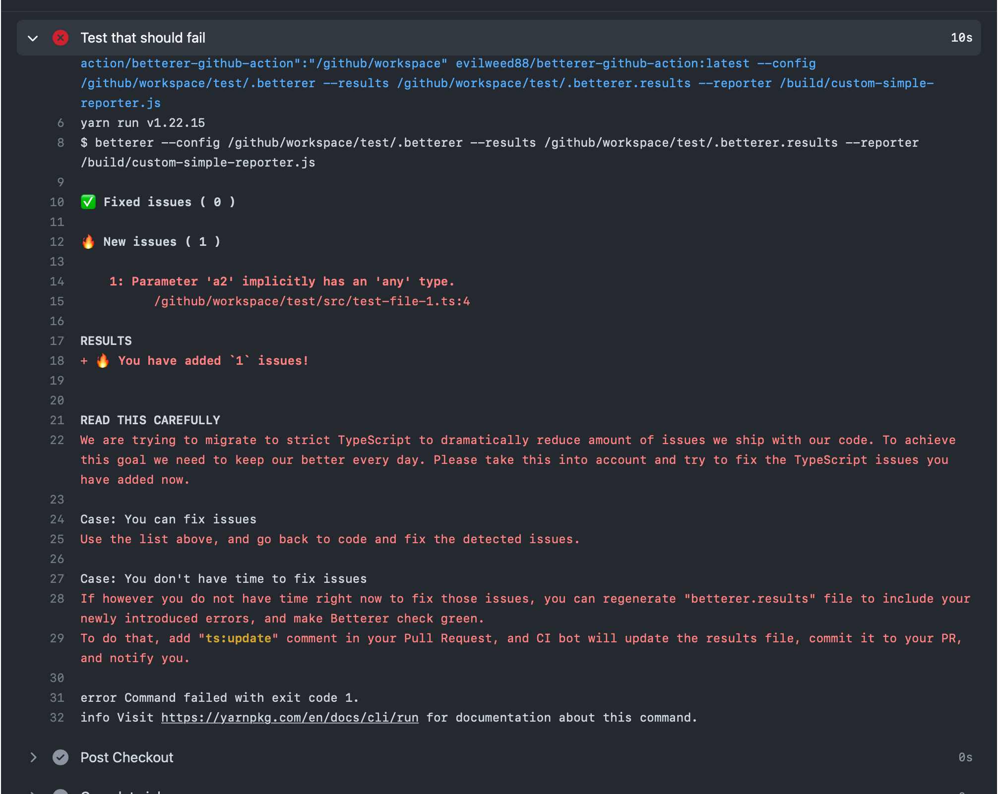

# Betterer docker github action

This action runs Betterer on Github Actions, and informs User how important Typescript migration is, and suggests fixing the offences, or suggests using ChatOps command to update `betterer.results` file.
This repository does not contain ChatOps functionality yet.
Stay tuned.



## Inputs

### `chatops_results_file_update_command`

**Required** Name of ChatOps command used to automatically update `betterer.results` file with new state. This input is only used to inform user in error messages. You need to implement chatops functionality yourself. Default `"betterer:update"`.

### `betterer_results_file_name`

**Required** Name of the `betterer.results` file or path to it. This input is only used to display error message. Default `"betterer.results"`.

## Outputs

### `new_issues_count`

Amount of newly introduced issues.

### `fixed_issues_count`

Amount of fixed issues.

## Custom reporter
If you prefer original betterer reporter, please remove `--reporter /build/custom-simple-reporter.js` from args.

## Example usage

```yaml
name: Run Betterer using docker github action
on:
  push:
    branches:
      - main

jobs:
  test:
    runs-on: ubuntu-latest
    timeout-minutes: 5
    steps:
      - name: Checkout
        uses: actions/checkout@v2
      - name: Run betterer
        id: betterer
        uses: Evilweed/betterer-github-action@main
        with:
          args: --config /github/workspace/test/.betterer --results /github/workspace/test/.betterer.results --reporter /build/custom-simple-reporter.js
          chatops_results_file_update_command: "ts:update"
          betterer_results_file_name: "betterer.results"
      - run: echo {{ steps.betterer.outputs.new_issues_count }}
      - run: echo {{ steps.betterer.outputs.fixed_issues_count }}
```
